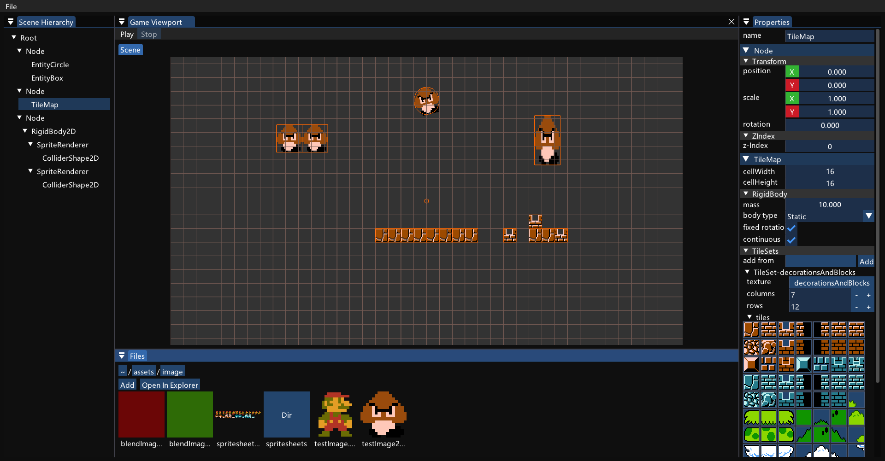

## Intro

A simple `Game Engine` written by `C++` with `GLFW3` & `ImGui`.

## Denpendens

- glfw3 & glad
- glm
- RTTR
- box2d

## Features

- [x] Node based architecture
- [x] Reflection based field display
- [x] JSON based serialization and deserialization
- [x] ImGUI based Viewport & Docking GUI
- [x] 2D sprite batch rendering
- [x] Integrated box2d
- [x] TIleMap

## Todo List

- [x] 1.CollisionShape2D As Node √
- [x] 2.Change Collision Shape on Right Panel √
- [x] 3.DebugDraw Fill Polygon √
- [x] 4.Draw Collision Shape with DebugDraw::FillPolygon Functions
- [x] 5.Prefabs System √
- [ ] 6.Reduce Reshape Function Call Times √
- [x] 7.Info Modal
- [x] 8.Tilemap Render √
- [x] 9.Tilemap TileSet UI √
- [x] 10.Add or Erase Tile By TileSet UI √
- [x] 11.Split TileSet System to Global

## Preview

